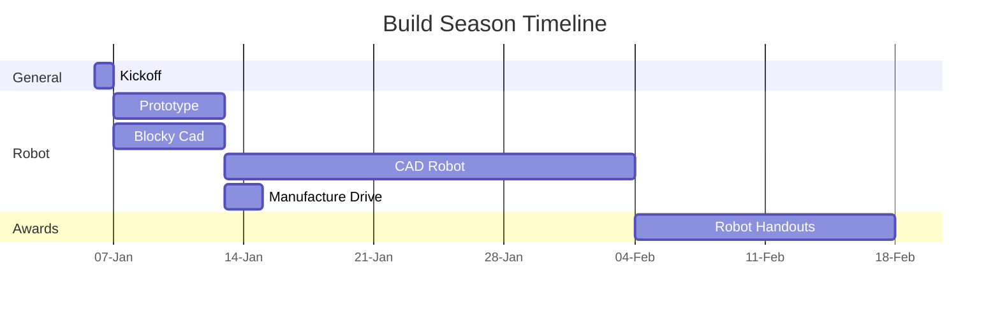

# Build Season

---
## Week 1
### Day 1 (Saturday)

- Read rules
- Basic section of kickoff worksheet
- Draft Priority lists
- xRC Simulator if it's out
- Understand scale of field/game objects
- Get models of game elements as needed

### Day 2 (Sunday)

- Detailed kickoff worksheet
- Points analysis
- Review and validate priority list
- Start [[Prototyping]]

### Day 3-7 (During the Week)

- Get lessons learned from [[Prototyping|prototypes]]
- Blocky #CAD
- Adjust priority lists as needed
- Adjust requirements as needed
- Develop a V1 real cad as needed
- [[Design]] concept internal reviews (2 per mech)
- Benchmark prototypes

---
## Week 2
### Day 8 (Saturday)

- Lock in robot [[Mechanism|mechanisms]] and general packaging
- Manufacture any v1 mechanisms
- Drive rails #CAD done, baseplate in workable condition
- Purchase [[drive train]] stuff as needed
- [[Strategy]] review/robot [[design]]
- Flesh out blocky cad to real mechanisms
- Auto paths

### Day 9 (Sunday)

- Make drive rails
- Start logic for robot code/building things for mechanisms
- Purchase hard to get/limited stuff we need/things we know we need
- Reviewing and benchmark any v1 mechs

### Day 10-14 (Weekday)

- Assemble drive base (excluding base plate)
- 3 [[design]] internal reviews for each mech (involve non team affiliated people)
- Revise v1 mechs if big improvements need to be made
- [[Drive team]] comms/terminology
- Decide data we are scouting + start making scouting system adjustments

---
## Week 3
### Day 15 (Saturday)

- Big [[design]] review (internal)
- Prioritize tasks that are being [[Sponsor]] machined
- [[Strategy]]/meta/priority list review
- Solidify sensors review
- Solidify fasteners
- Solidify [[electrical]] routes

### Day 16 (Sunday)

- External review
- Order sensors, fasteners
- Make and send out part drawings for [[Sponsor]] made parts (baseplate, gussets, sheet metal)
- Decide controls layout
- Order COTS that we know we need
- Bill of Materials

### Day 17-21 (Weekday)

- Make drawings for internal [[manufacturing]]
- External reviews if available
- All hands on deck for assembly and manufacturing
- Layout framework in code for [[motors]] and sensors
- Paint as needed
- Start making bumpers

---
## Week 4

### Day 22 (Saturday)

- ASSEMBLE AND MAKE
- CAD "Finalized"
### Day 23 (Sunday)

- Finish Assembly

### Day 24-28 (Weekday)

- Wire robot
- Test/Code mechanisms as able

---
## Week 5

### Day 29 (Saturday)

- Finish Wiring
- Test/Code mechanisms as able

### Day 30 (Sunday)

- [[Scouting]] app + Website done
- Test [[Mechanism|mechanisms]]/tune control loops
- Bumpers done

### Day 31-35 (Weekday)

- Tune all mechanisms
- Tune auto path following
- Practice driving
- Start robot [[design]] handout
- Benchmark mechanisms
- Start designing new revisions of [[Mechanism|mechanisms]] as needed
- Move to [[Kingston Robotics Lab]]

---
## Week 6

### Day 36-37 (Weekend)

- Create autos
- Practice
- Manufacture new revs as needed
- Benchmark mechs

### Day 38-42 (Weekday)

- Practice
- Manufacture and design new revs as needed
- Improve autos
- Benchmark mechs

---
## Week 7

### Day 43-45 (Family day weekend)

- Robot road trip
- Practice
- Improve autos
- Manufacture and design new revs as needed
- Benchmark

### Day 46-49 (Weekday)

- Practice
- Improve autos
- Manufacture and [[design]] new revs as needed
- Design handouts done
- Data validation done
- Benchmark

---
## Rest of time

- Practice
- Improve autos
- Manufacture and design new revs as needed
- Benchmark
