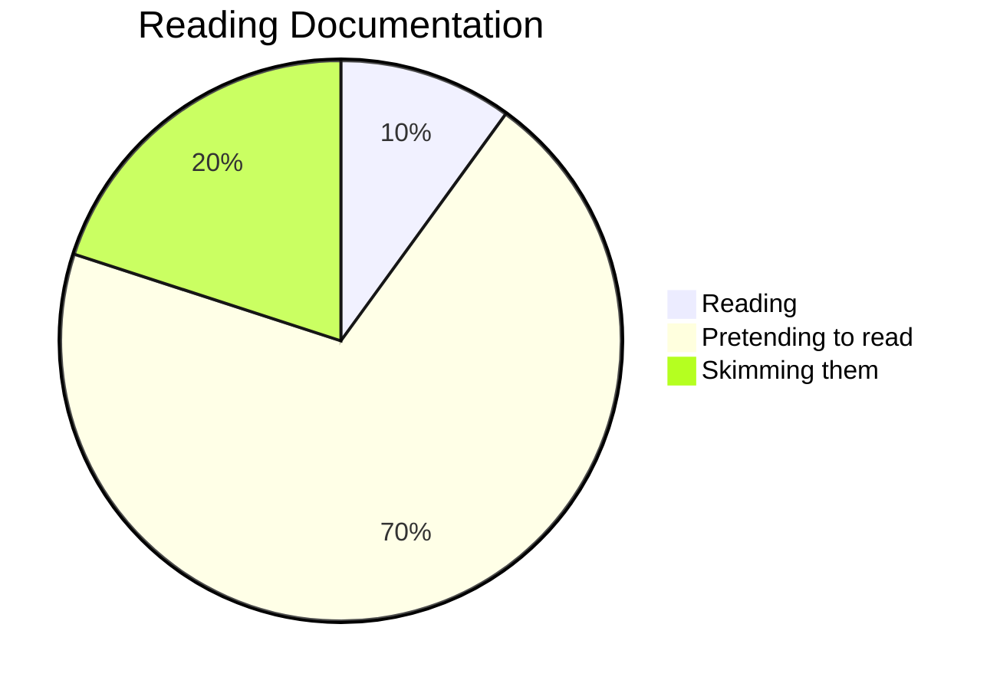

# Goals for the Site

The goal for this site is to have a fully comprehensive, searchable resource for all things [[W.A.F.F.L.E.S.]] so that we can improve our skills year over year. The whole website is not designed to be a guide for all teams, but a guide for our team and how we do things that other teams can read and take inspiration from for what they think can fit with their systems if they want.

Stuff that's hosted on the site:

- [[Design]] guidelines, how to actually design
- [[Manufacturing]] methods and the [[Tools]] we use. When you might use some of those tools
- [[Electrical]] references for how-tos and referencing schematics
- [[Solidworks]] guides on getting set up and following our team's practices.
- [[Event & Season Reviews]] for reflecting on what we did well/need to improve on.
- #blog like notes documenting our team's process, thoughts, for later review and learning what worked and what didn't.
- [[Competition Roles]] documentation, as well as how we actually execute each role, what we care about
- [[Previous 4476 Robots]] and learnings from old robots that are easily referenceable so we can learn from past mistakes and successes
- [[FRC Season Reviews]] for detailed looks at an [[FRC]] season as a whole, what strategies, robots, and [[Mechanism|mechanisms]] were dominant and why.
## New notes/pages vs tags
### Tags for general concepts

- CAD
- Design
- Strategy
- Solidworks
### Pages/notes for physical things we may want info on

- Roborio
- PDH
- Cim motor
- Solidworks

### Mix of both

CAD will have its own page describing what it is, but notes will have tags for those concepts broadly, as we wont link to the CAD page on every single note.

# Editing Syntax
## Markdown stuff

Using `**bold**` **bolds**

Using `*italic*` *italicizes*

using `_italic_` _italicizes as well_

Using `[[is an internal link]]` [[Index]]

Using `[is an external link](https://www.google.com/)`[is an external link](https://www.google.com/)

Using `# header 1` for headers, each # brings one layer down

<span style="color:yellow">Hello world!</span>

<span style="color:red">Hello world!</span>

Using `>` show up as a 

> quote block

Triple Backticks creates a code block

```
code goes here
```

Strikethru is `~~` ~~like so~~ 

Highlight is `==` ==Highlighted text== 

Comments look like %%Comment%%

Embed a video ``


Embed a tweet ``


Doing `---` will create a dividing line like this


---
### Callouts

```
> [!info] This is an info callout
> Text Here
```

> [!info] This is an info callout
> Text Here

```
> [!note] This is an note callout
> Text Here
```

> [!note] This is an note callout
> Text Here

```
> [!abstract] This is an abstract callout
> Text here
```

> [!abstract] This is an abstract callout
> Text here

```
> [!error] This is an error callout
> Text here
```

> [!error] This is an error callout
> Text here

```
> [!todo] This is an todo callout
> Text here
```

> [!todo] This is an todo callout
> Text here

```
> [!tip] This is an tip callout
> Text here
```

> [!tip] This is an tip callout
> Text here

```
> [!success] This is an success callout
> Text here
```

> [!success] This is an success callout
> Text here

```
> [!question] This is an question callout
> Text here
```

> [!question] This is an question callout
> Text here

```
> [!failure] This is an failure callout
> Text here
```

> [!failure] This is an failure callout
> Text here

```
> [!bug] This is an bug callout
> Text here
```

> [!bug] This is an bug callout
> Text here

```
> [!example] This is an example callout
> Text here
```

> [!example] This is an example callout
> Text here


```
> [!quote] This is an quote callout
> Text here
```

> [!quote] This is an quote callout
> Text here


---
## YAML and Frontmatter

At the very top of the page, typing `---` will start frontmatter data. This is for configuring different aspects of the page that are important.

### Aliases

You can configure aliases for pages (other names that the page can be linked under)


for example the mentor page has a few aliases that when you search using a link will show up. This can help a lot with things that go under the same name but have different capitalization. It also can be used for things that may have multiple reasonable names, for example [[Eliminations|Playoffs]] and [[Eliminations|Eliminations]] both link to the same page.

### Table of Contents

If there is a page you don't want to show the table of contents, you can add `showToc: false` to the frontmatter

### Date

Setting a correct date for a note, you can add a `date` object in the front matter

### Tags

You can also add a tag attribute to add tags to a page.

## Mermaid Diagrams

It's possible to use [Mermaid](https://mermaid.js.org/syntax/examples.html) to create charts and diagrams for Obsidian.

All Mermaid charts are started with triple backticks, then mermaid

### Pie Chart

```
pie title NETFLIX
         "Time spent looking for movie" : 90
         "Time spent watching it" : 10
```




### Gantt Charts

[Gantt chart documentation stuff](https://mermaid.js.org/syntax/gantt.html) Example gantt chart for [[Season Timeline]]


# Recommended Plugins

https://github.com/gavvvr/obsidian-imgur-plugin/blob/main/README.md